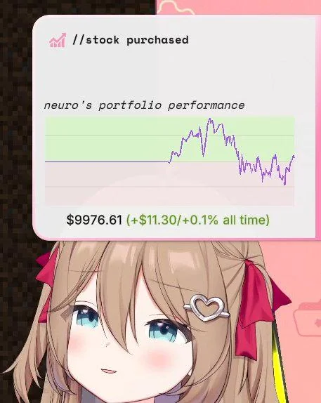

# Neuro Stocks Visualiser

Live, auto-refreshing view of Neuro's trading portfolio.

## What it shows
- Portfolio summary: value, cash, P/L vs. initial capital, latest move.
- Equity curve: downsampled line chart of historical equity.
- Open positions: qty, market value, basis, price, prev close, intraday change.
- Recent activity: latest fills flattened and sorted.- Sleep status: optional banner if the bot is streaming “I’m Only Sleeping”.
## How it works
- Data source: `https://raw.githubusercontent.com/VedalAI/neuro-stocks-data/main/portfolio.json` (fetched every 30s).
- Sleep status: fetched from a Cloudflare Worker; 
client-side cached for 60s.
- Frontend: static HTML/CSS/JS (Chart.js for the equity chart).
- Nginx: sample config in `nginx/neuro-stocks.conf` (TLS, SPA fallback, asset caching, dotfile deny, optional proxy rule for the Worker path).

## Files at a glance
- `index.html` — layout and meta tags.
- `styles.css` — theming, layout, typography.
- `app.js` — data fetch/refresh, rendering, sleep banner logic.
- `env.example.js` — copy to `env.js` and set `window.TWITCH_PROXY_URL` (Worker endpoint).
- `nginx/neuro-stocks.conf` — example server config.
- `cloudflare-worker/` — Worker code for the sleep-status proxy.

## Notes
- Serve over HTTP/HTTPS (not `file://`) to avoid CORS issues.
- Keep secrets out of `env.js`; only the public Worker URL should live there.

## Special Thanks
- Vedal, for smadge content
- Neuro, for the uuh content
- GPT Codex, for generating the whole codebase LULE
- GitHub Copilot, for the commit messages xdd

